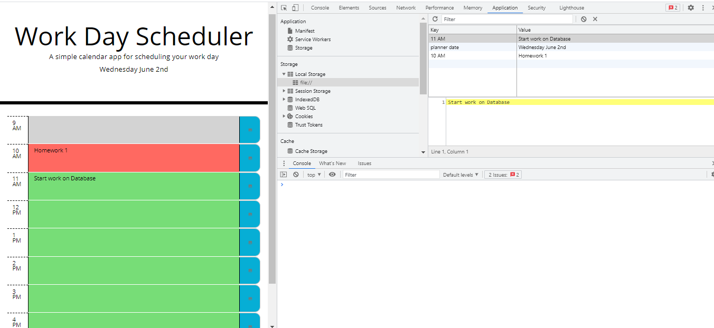
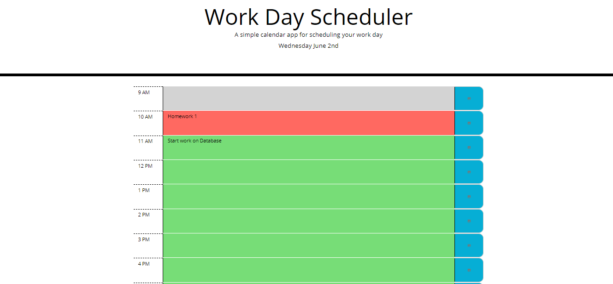

# Work Day Scheduler
This application will allow you to schedule events throughout your day and save the data locally, so that you can access, refresh, and update your tasks throughout the day.

 ### Table of Contents
 * [Descritption](#description)
 * [Technologies-Used](#technologies-used)
 * [Installation](#installation)
 * [Usage](#usage)
 * [License](#license)
 * [Contribution](#contribution)
 * [Tests](#tests)
 * [Resources](#resources)
 * [Questions](#questions)
___
  ## Description
  Using javascript, jQuery, jQuery UI, and bootstrap to make a day planner that will allow you to type in and save tasks for a certain hour of the work day. The scheduler will also update thoughout the day and is color coded so that the current hour is red, any past hour is gray, and any future hour is green. Any events typed into the scheduler are saved to local storage so reloading the page will keep your tasks in place.

  
  

## Technologies-Used
* HTML
* CSS (Bootstrap)
* JavaScript (jQuery)

----

 ## Installation
 No installation steps are required to view this project.The application can be viewed live here at [Work Day Scheduler]()

[Back to Table](#table-of-contents) 

 ## Usage
Work-day-scheduler is a simple application that allows a user to save events for each hour of the day. It runs in the browser and feature dynamically updated HTML and CSS powered by jQuery and Bootstrap.

A view of the dashboard:

  

[Back to Table](#table-of-contents) 

## License 
This project has not yet been licensed, and thus, standard copyright laws apply.

## Contribution
 Nishad Kurup  is the sole contributor to this project. HTML and CSS source  code was provided by the MSU Coding Bootcamp/Trilogy Education Services.

  [Back to Top](#table-of-contents)

  ## Tests
  There are currently no tests written for this project.

  [Back to Top](#table-of-contents)

 ## Resources
 1. [Bootstrap](https://getbootstrap.com)
 2. [jQuery](https://api.jquery.com)
 3. [Local Storage](https://developer.mozilla.org/en-US/docs/Web/API/Window/localStorage)
 4. [Moment.js Docs](https://momentjs.com/docs/#/displaying)
    

  ## Questions
  If you have any questions about this application my GitHub username is
  [nishadkurup](github.com/nishadkurup) and you can view my GitHub profile at https://github.com/nishadkurup. 

  For any additional questions, feel free to reach out to me at Email: nishadkurup@gmail.com .

